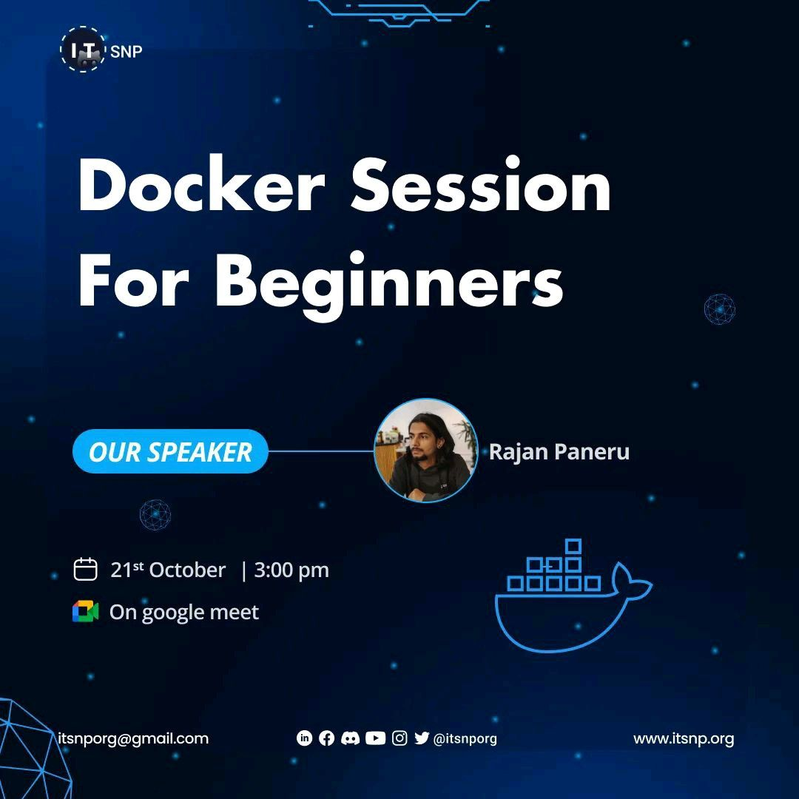

# Workshop-Docker-session-for-Beginners

Date: 21st October 2022
Time: 3 p.m onwards
Platform: Google Meet

This workshop will mainly focus on describing how Docker will be useful and generating excitement to dig deeper.

This is an online session given over the Google Meet, You can watch the video by clicking this link:

Click to go to [Workshop Slides](workshop/workshop.md)

## Q / A

#### What role docker plays for such projects where the number of developer is only one person? Yes, it is good for virtualization for multimember project but why is it necessary for single member projects?

### Is there any way to try/learn docker online/cloud for user having incompatible device to use docker??
Great question, I never had to look for a way to run docker online. But I found good one during quick google search:

Play with Docker, I think this gives you 4hr session, should be enough to fiddle.
Link: https://labs.play-with-docker.com/ https://www.docker.com/play-with-docker/

### For whom are docker most important to?

### Detailed introduction on the topic for beginners.

### How to build an ecosystem of applications.

### I would like to ask about the career as DevOPs engineer in Nepal and outside the country.

### How to get maximum(optimal) results from docker. And are there any alternatives?

### Why were you interested in docker?

### What is docker and what is it used for why do we use it!!

### Why is docker used

### Kubernetes

## Reference
