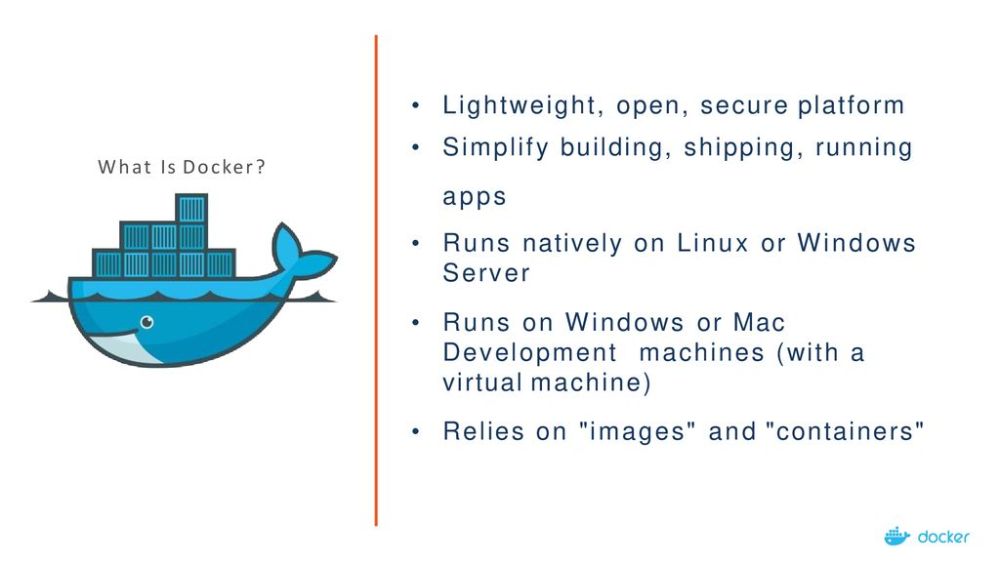
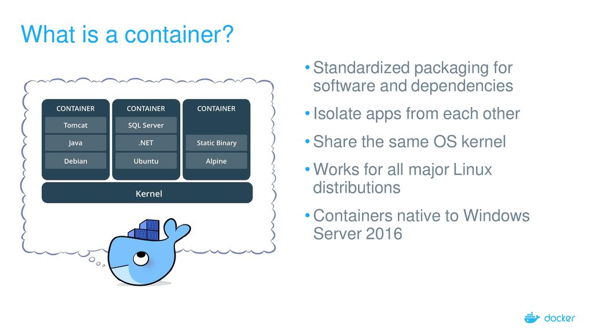
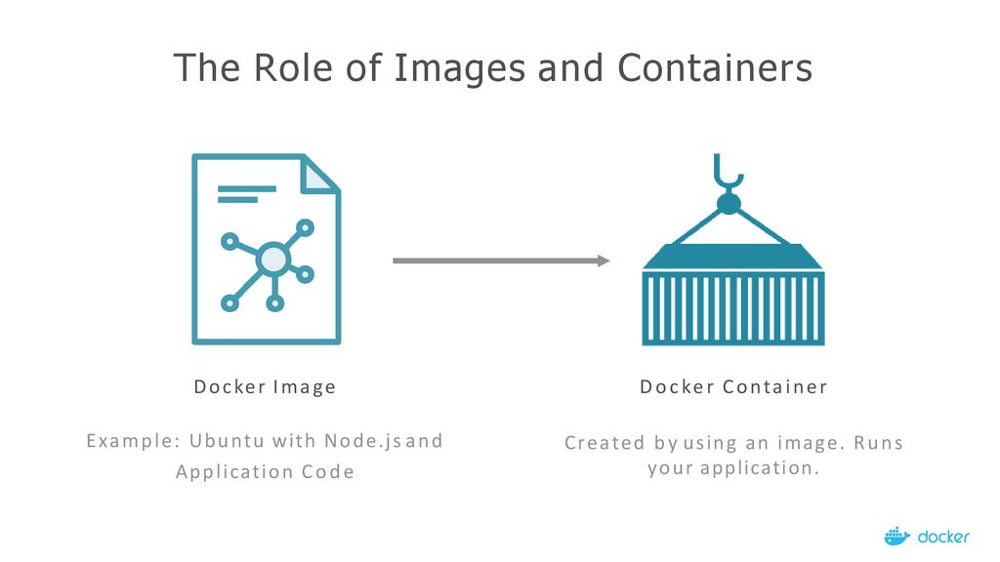
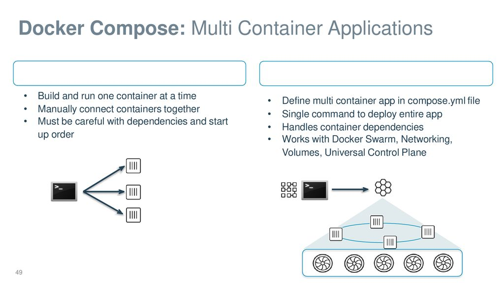
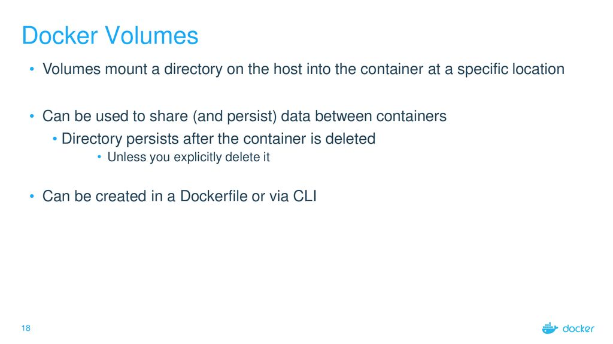
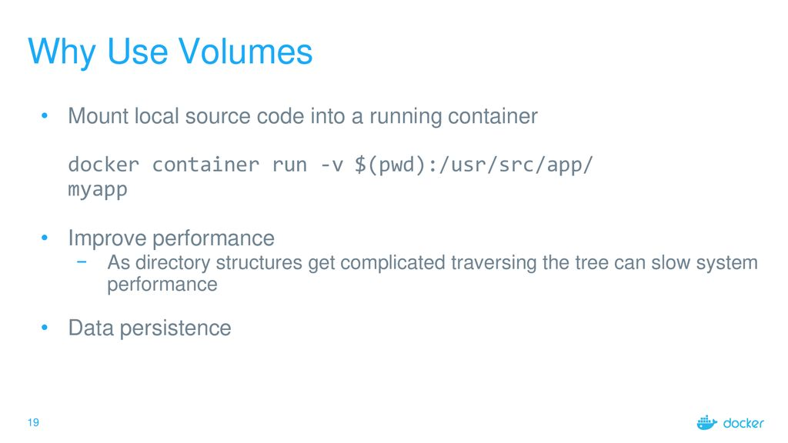
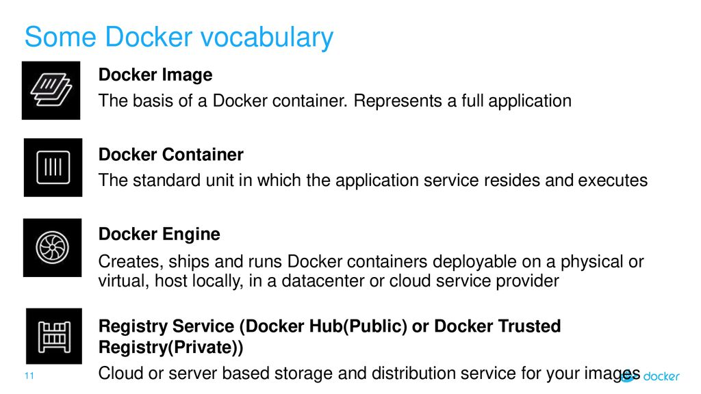
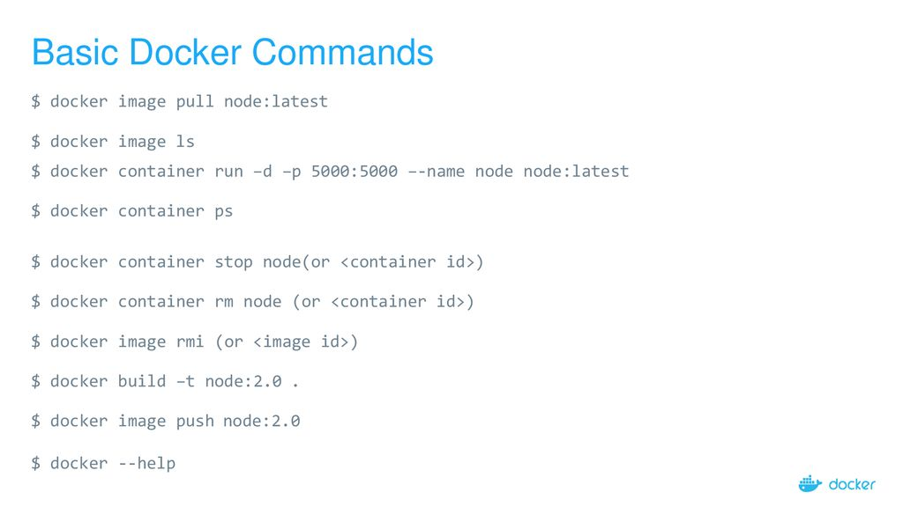

# Docker Workshop

## Introduction

I am Rajan Paneru. I've been using Docker in the professional environment from last 6-7 years.

Current Company: https://www.ranenetwork.com/ https://www.linkedin.com/company/rane

Github: https://github.com/paneru-rajan

Stackoverflow: https://stackoverflow.com/users/2994954/rajan

---

## What this workshop is about

1. Explain the docker in the simplest form possible
2. Sharing my experience with the docker and it's benefits
3. Generating excitement to learn/try further

---

## Docker

Docker is an open platform for developing, shipping, and running applications. Docker enables you to separate your
applications from your infrastructure so you can deliver software quickly. With Docker, you can manage your
infrastructure in the same ways you manage your applications. By taking advantage of Docker’s methodologies for
shipping, testing, and deploying code quickly, you can significantly reduce the delay between writing code and running
it in production.

Why

1. Fast, consistent delivery of your applications
2. Responsive deployment and scaling
3. Running more workloads on the same hardware

> Overview is from the official site: https://docs.docker.com/get-started/overview/

### Install / Start

Install Docker Desktop on Mac: https://docs.docker.com/desktop/install/mac-install/

Install Docker Desktop on Windows: https://docs.docker.com/desktop/install/windows-install/

Install Docker Desktop on Linux: https://docs.docker.com/desktop/install/linux-install/

### Containers

A container is a runnable instance of an image.

### Docker Image

An image is a read-only template with instructions for creating a Docker container.

### Docker Compose

Compose is a tool for defining and running multi-container Docker applications.

### Volumes

### Vocabulary

### Commands

---

## Links / References

1. Play with Docker: https://labs.play-with-docker.com/
2. LearnDocker.online: https://learndocker.online/
3. Slide on Introduction to Docker: https://slideplayer.com/slide/14309525/
4. Docker For Beginner
   from [Prakhar Srivastav](https://github.com/prakhar1989/docker-curriculum): https://docker-curriculum.com/
5. Docker overview: https://docs.docker.com/get-started/overview/

### Video Tutorials

1. Docker Tutorial for Beginners --> Programming with Mosh : https://youtu.be/pTFZFxd4hOI
2. Docker Tutorial for Beginners --> TechWorld with Nana: https://youtu.be/3c-iBn73dDE
